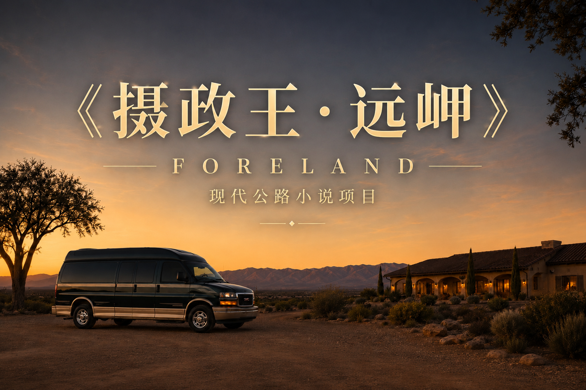

  

<h1 align="center">《摄政王·远岬》</h1>

<strong>现实主义底色下的公路浪漫史诗</strong>

一辆从事故残骸中重生的重型房车，一群把日常生活驶成传奇旅程的冒险者。

---

林峻是一名电气工程师，喜欢研究车辆与机械，也享受把一项复杂工程逐步变成现实的过程。与妹妹林漪、导师Sam、摄影师Nico、基友Steve、修理师Rafa、女友沈嘉宁等人共同生活的岁月里，他将一辆普通的GMC Savana厢式货车从事故残骸中涅槃重生，反复拆解、返工、升级，最终将它变成名为“摄政王”的移动宫殿。

摄政王既是一项永远无法真正完工的机械工程，也是贯穿主角团生活的移动基地。它把城市与荒野、雪山与海岸连接在一起，也把狩猎、海钓、极寒、故障、争吵与救援变成他们共同生活的一部分。漫长公路由此不再只是路线，而成为一场又一场多年以后仍会被反复讲起的美洲冒险。

  

> 人的一生值得拥有几个真正可靠的伙伴、几台亲手打造的机器，以及一些多年以后能够反复回忆的传奇冒险。

## 当前创作状态

项目已经建立作品定义、人物与关系档案、车辆和装备设定、总时间轴、九卷结构以及第一卷多个正式剧情单元。目前正式进入第一卷《自新大陆》的正文写作阶段。

本仓库同时承担小说正史管理、剧情规划、连续性维护、现实资料核查和正文版本管理。仓库中的完整人物设定与大纲包含剧透；本页只保留无剧透的作品总述。

## 仓库导航

| 目录 | 内容 |
|---|---|
| [`00_项目总控/`](./00_项目总控/) | 作品定义、正史规则、索引、文风和创作工作流 |
| [`01_故事圣经/`](./01_故事圣经/) | 人物、人物关系、世界观、地理与生活规则 |
| [`02_机设与装备/`](./02_机设与装备/) | 摄政王及其他车辆、枪械、装备与专项机械设定 |
| [`03_大纲/`](./03_大纲/) | 总体故事线、九卷规划、剧情单元与故事池 |
| [`04_正文/`](./04_正文/) | 正式章节、修订稿与后续正文版本 |
| [`05_连续性管理/`](./05_连续性管理/) | 总时间轴、章节事实、人物与车辆状态 |
| [`06_素材池/`](./06_素材池/) | 可浮动使用的地点、日常、事件与创作素材 |
| [`07_参考资料/`](./07_参考资料/) | 写作时需要回查的现实资料与研究记录 |
| [`08_版本与审校/`](./08_版本与审校/) | 版本差异、审校记录和质量检查 |
| [`09_工具与自动化/`](./09_工具与自动化/) | 小说专用 Skill、提示词、模板与协作工具 |

## 创作方式

这是一个使用AI辅助的长篇小说项目。AI用于资料整理、设定一致性检查、剧情讨论和正文协作；作品方向、人物选择、正史决策与最终取舍由作者持续控制。仓库始终以当前正式文件为唯一依据，旧方案和归档内容不覆盖现行正史。

---

<em>一艘不断扩建的陆地远航船，和一群愿意登上它的人。</em>

